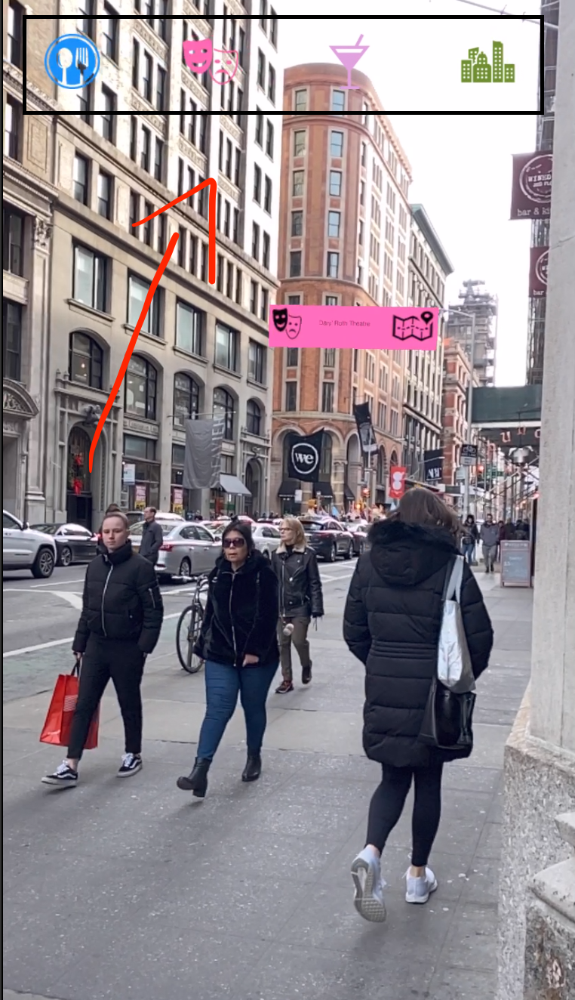
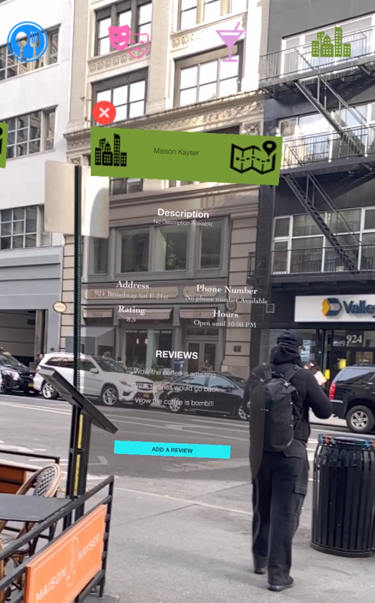
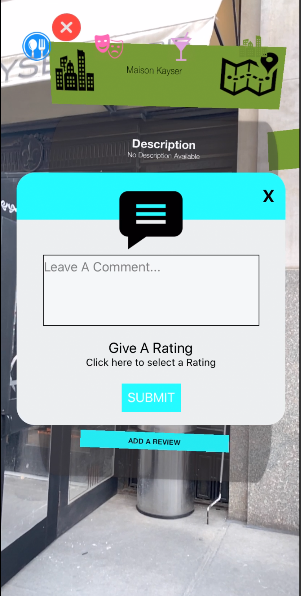
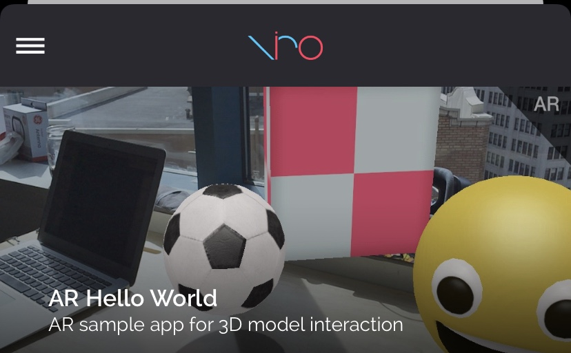
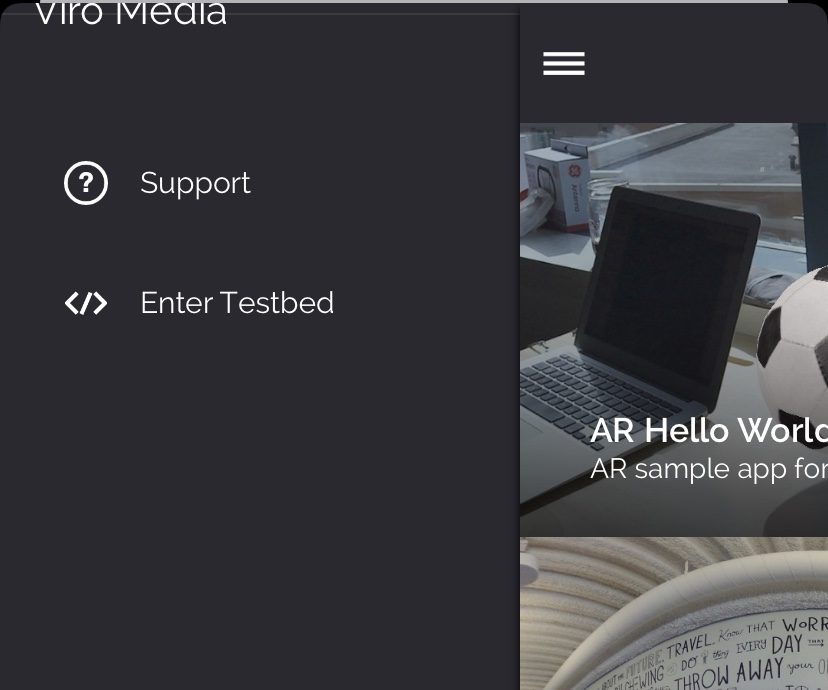
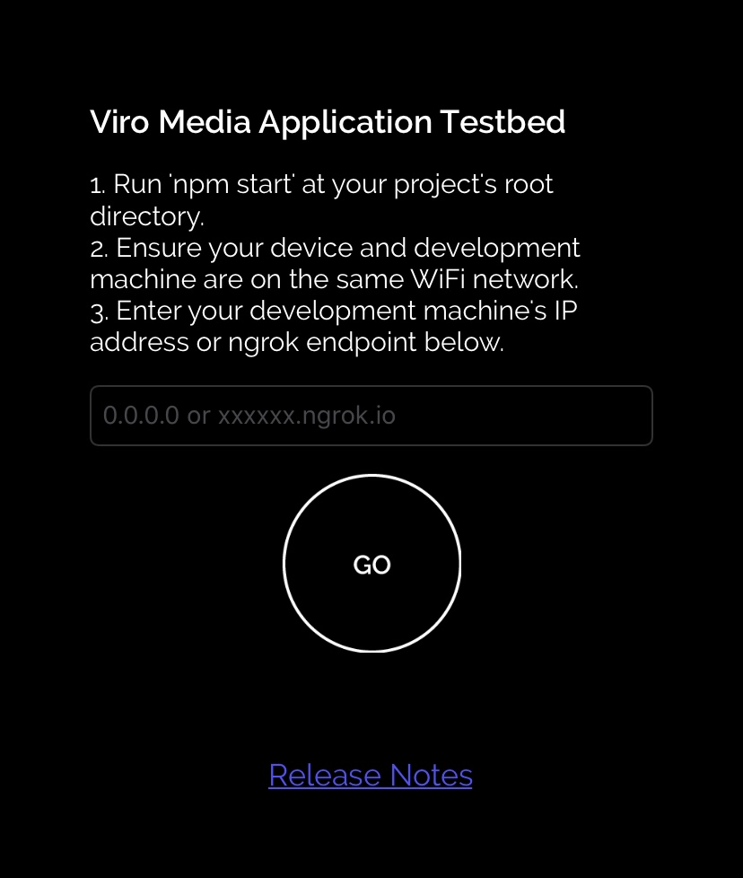

<!-- # capstone

## Project Title - mARket

## Overview
## Create an application to place advertisements in the AR World.

## MVP
## Place a 2D image on a physical wall. Users will be able to
## request an advertisement image to be placed. The advertisement should be static.

## Stretch Goals
## Getting the advertisement on a specific building wall based on the user's
## address input.

## Technical Challenges
## Grabbing the Z-coordinates in the cartesian coordinate system and inputting it
## into our AR world. -->

# AR WORLD

AR World is an augmented reality mobile application that allows users to interact with the world around them. Users can visit places and view their information or leave reviews for others to see.

# Features

<h3>Filtering</h3>

<h3>View Information</h3>

<h3>Adding Reviews</h3>


## Getting Started

<h3>Basic setup</h3>
Fork the project then clone it:

```
git clone https://github.com/yourgithubname/AR-WORLD.git
```

Install modules:

```
npm install
```

In the terminal of the root directory of the project run:

```
npm start
```

Install the Viro Media app on your mobile device from the <a href="https://play.google.com/store/apps/details?id=com.viromedia.viromedia&hl=en_US"> Google Playstore </a> or the <a href="https://apps.apple.com/us/app/viro-media/id1163100576">App Store </a>. <br /><br/>

Open up the ViroMedia application and click the hamburger menu on the top left:
<br/>
<br/>

<br/>
<br/>
Click enter testbed:
<br/>
<br/>

<br/>
<br/>
Enter your ngrok endpoint, located in your terminal/ or enter your computer ip address located in your network settings:
<br/>
<br/>

<br/>
<br/>
Enjoy!

## Built With

- [React Native](https://facebook.github.io/react-native/) - Framework for Android and ios
- [Node.js](https://nodejs.org/en/) - JavaScript Runtime
- [Viro](https://viromedia.com/) - AR/VR Library
- [Axios](https://www.npmjs.com/package/axios) - HTTP client

## Authors

- **Phurba Sherpa** - _Developer_
- **Yooni Park** - _Developer_
- **Martin Ng** - _Developer_
- **Alex Penaloza** - _Developer_
